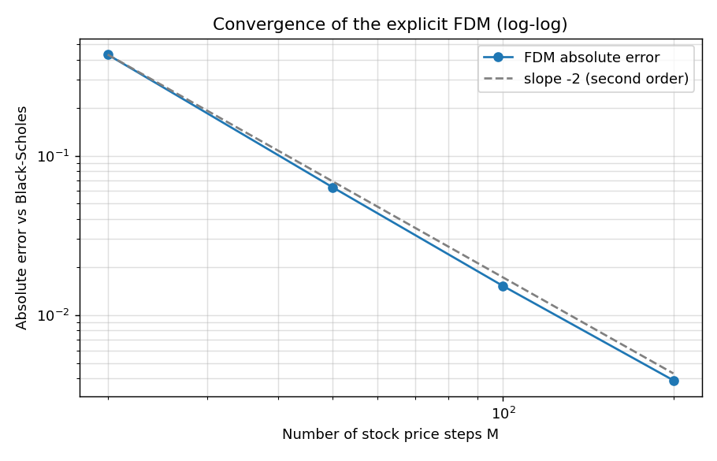
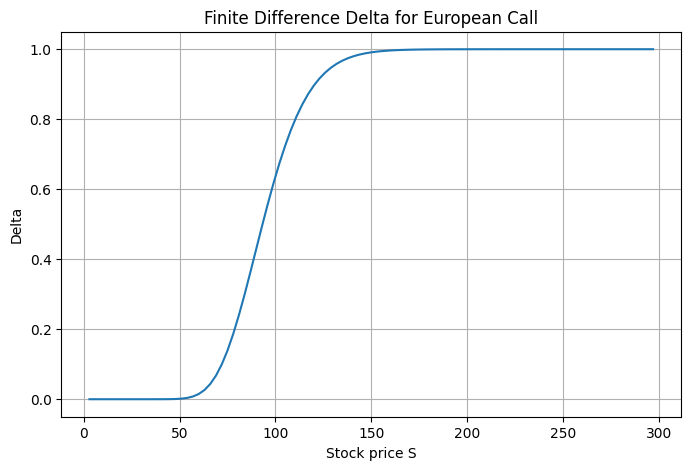
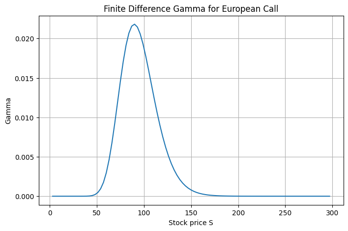
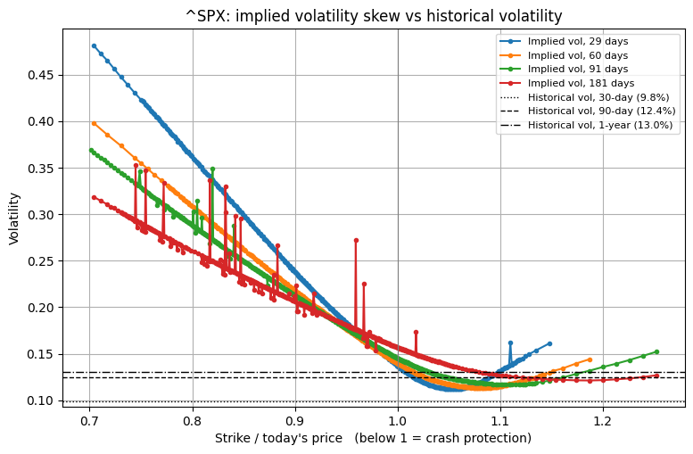
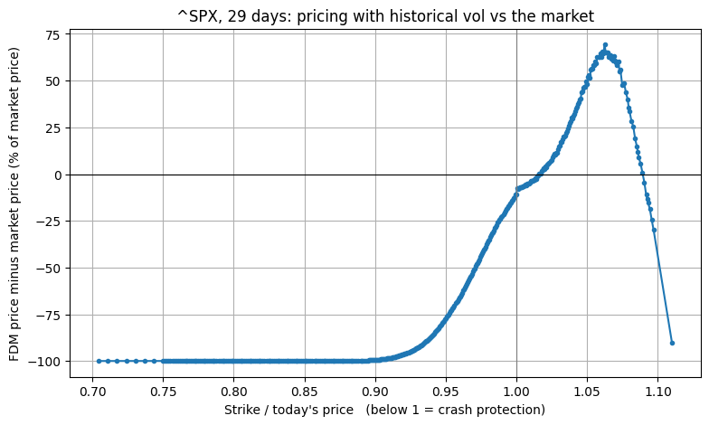
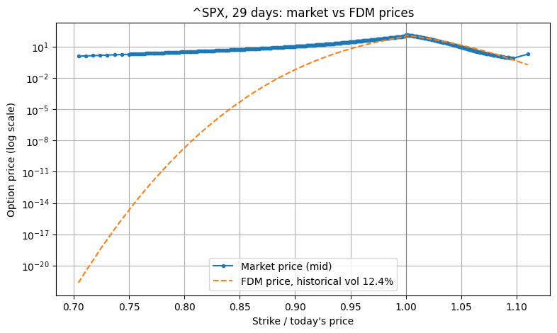

# Pricing Options with Finite Differences: Where Historical Volatility Fails

A finite difference (FDM) solver for the Black-Scholes equation, validated against the exact formula and then tested against real S&P 500 option prices using implied volatility.

**Main finding:** pricing with historical volatility gets ordinary options roughly right, but values crash protection at almost nothing. A 29-day S&P 500 put with its strike 10% below the index costs **10.45 points** in the market. The FDM at historical volatility prices it at **0.06**. A seller using that model would be both underpaid and underhedged (holding about **2%** of the hedge the market's pricing implies) for exactly the event that hurts most.

---

## The question

Black-Scholes needs one input nobody knows: volatility. Part 1 estimates it from the past (historical volatility). Part 2 asks: **if you price options with historical volatility, how far are you from what the market actually charges, and where?**

## Part 1: The FDM pricer

The Black-Scholes PDE is solved with an explicit finite difference scheme on a grid of stock prices and times. Starting from the known payoff at expiry, the solver steps backwards in time. Each grid value is a weighted average of three neighbouring values one time step later. Boundary conditions fix the value at S = 0 and at the top of the grid.

**Validation.** For a 1-year at-the-money call (S = 100, K = 100, r = 5%, σ = 20%):

| | Price |
|---|---|
| FDM (M = 100, N = 10,000) | 10.4658 |
| Black-Scholes formula | 10.4506 |
| Absolute error | 0.0152 |

**Convergence.** Halving the stock-price step reduces the error about four times, the second-order convergence expected from central differences:

| M | dS | Absolute error |
|---|---|---|
| 20 | 15.0 | 0.4308 |
| 50 | 6.0 | 0.0633 |
| 100 | 3.0 | 0.0152 |
| 200 | 1.5 | 0.0039 |



**Stability.** The explicit scheme is stable only if σ²M²dt < 1 (all three weights stay positive). The test case gives 0.04, and the solver in Part 2 increases the number of time steps automatically when needed.

### The Greeks: delta and gamma

Both are read directly from the FDM grid using differences between neighbouring stock prices.

**Delta** is the rate of change of the option price with respect to the stock price: how much the option's value changes when the stock moves by 1. It is also the number of shares a seller holds to hedge one option.



With the strike fixed at 100, delta rises from 0 to 1 as the stock price rises relative to the strike:

- **Stock far below the strike (deep out of the money):** delta ≈ 0. The option will almost certainly expire worthless, so small stock moves barely change its value.
- **Stock far above the strike (deep in the money):** delta ≈ 1. The option will almost certainly be exercised, so it moves one-for-one with the stock.
- **Stock near the strike:** delta is a little above 0.5 (about 0.64 at S = 100). Interest makes the stock drift upwards in the model, so an at-the-money call is slightly more likely to finish in the money than not. The notebook reports delta = 0.617 at the nearest grid point, S = 99, matching Black-Scholes there (0.618).

**Gamma** is the rate of change of delta with respect to the stock price: the curvature of the option price. It measures how quickly the hedge goes out of date as the stock moves.



Gamma is the slope of the delta curve, so it peaks where delta changes fastest. Far from the strike, the outcome is almost decided either way and delta is flat, so gamma is near zero. Near the strike, the outcome is finely balanced: a small move in the stock noticeably changes how likely the option is to be exercised, so delta changes quickly.

The peak is at S ≈ 89.6, below the strike, for two reasons. First, delta depends on where the stock sits *relative to* the strike, in percentage terms, not in absolute points. A move of 1 is a bigger percentage move at a lower price (1.25% at S = 80, 0.83% at S = 120), so it shifts the stock-to-strike ratio more and changes delta more. That pushes gamma up on the left. And in the model the stock drifts upwards over time with the interest rate: starting at 100 it has about a 56% chance of finishing above the strike, not 50%. A true 50/50 outcome needs a starting price slightly below the strike (about 97 here), so the region where the outcome is most finely balanced already sits below 100. Black-Scholes puts the peak at K·exp(−(r + 1.5σ²)T) = 100·exp(−0.11) ≈ 89.6, matching the FDM result. At S = 99, gamma = 0.0193 (Black-Scholes: 0.0193): delta rises by about 0.019 for each 1 increase in the stock price.

**As expiry approaches.** The grid stores the option value at every time step, so delta and gamma can be read off at any date:


With less time left, the delta curve becomes steeper and the gamma peak narrower, taller and closer to the strike: about 0.022 at S ≈ 90 with 1 year left, 0.040 at S ≈ 97 with 3 months, and 0.070 at S ≈ 99 with 1 month. With little time, the stock can only move a short distance, so whether the option ends up exercised is decided almost entirely by which side of the strike it is on. In the limit, at expiry, delta jumps from 0 to 1 exactly at the strike. For an option seller, high gamma near expiry means the hedge must be adjusted very frequently when the stock is close to the strike.

### Does the pricer behave as theory predicts?

Beyond matching the exact formula, each sensitivity behaves as expected:

- **Volatility.** The test call rises steadily from 6.83 at 10% volatility to 21.80 at 50%. More volatility means more chance of a large gain while the loss is capped at the premium. Because price always increases with volatility, each market price corresponds to exactly one implied volatility (used in Part 2). The FDM error falls as volatility rises (0.020 at 10%, 0.007 at 50%), because a smoother price curve is easier to approximate on a fixed grid. Compared with the payoff (the hockey stick with a sharp corner at the strike), the value curve today at 10% volatility stays close to that corner and bends sharply around the strike (value about 6.8 at S = 100), while at 50% it is lifted well above it and bends gently over a wide range of stock prices (about 21.8 at S = 100). The FDM estimates the curvature from three grid points 3 apart, which captures a gentle bend more accurately than a sharp one.
- **Maturity.** A one-month at-the-money NVDA call (S = 230.86, K = 230, σ = 39.4%) costs 11.18. At 3, 6 and 12 months it costs 19.42, 27.78 and 40.30. More time gives the stock more room to move, but uncertainty grows with the square root of time, not time itself, so the price grows roughly with √T: 11.18 × √3 ≈ 19.4 and 11.18 × √6 ≈ 27.4. Longer maturities sit slightly above this rule because paying the strike later is worth more over a longer period.

  The FDM error also falls with maturity, from 0.020 at 1 month to 0.006 at 1 year. With little time left, the value curve today is still close to the payoff's sharp corner at the strike, which is harder to approximate on the grid. With more time, it becomes smoother. Volatility and time have the same smoothing effect, and they act together through σ√T, the typical percentage move of the stock before expiry: the smaller σ√T, the sharper the curve and the larger the error.
- **Across stocks.** The pricer was applied to one-month at-the-money calls on five stocks. Raw prices cannot be compared directly, because an option on a $500 stock naturally costs more dollars than one on a $230 stock. Dividing each price by its stock price gives the cost per dollar of stock:

  | Stock | Volatility | Option price | Price / stock price |
  |---|---|---|---|
  | JPM | 20.7% | 7.57 | 2.3% |
  | AAPL | 29.5% | 11.83 | 3.6% |
  | MSFT | 39.4% | 22.83 | 4.5% |
  | NVDA | 39.4% | 11.18 | 4.8% |
  | TSLA | 52.9% | 21.51 | 6.1% |

  Relative to its stock price, the TSLA option is the most expensive and the JPM option the cheapest, and the ordering follows volatility exactly: a more volatile stock is more likely to make a large move, so its option is worth more. The cost is close to the standard approximation 0.4 × σ × √T (for TSLA: 0.4 × 0.529 × √(1/12) ≈ 6.1%). MSFT and NVDA have the same volatility but slightly different costs because their strikes were rounded: NVDA's is slightly in the money, MSFT's slightly out of the money. In plain dollars MSFT's option is the most expensive, but only because its stock price is the highest.
- **Historical volatility window.** For NVDA the 30-day, 90-day and 1-year estimates (38.4%, 39.4%, 37.7%) give option prices of 10.93, 11.18 and 10.73: the price depends on which past window is chosen, and nothing in the model says which is right. Part 2 addresses this with market prices.

## Part 2: Implied volatility

**Data.** S&P 500 index options (European, cash-settled) from Yahoo Finance for expiries of 29, 60, 91 and 181 days. Prices are bid-ask mids. Options with no quotes, spreads above 50% of the mid, or strikes outside 70–130% of the index level are removed. Inputs: index level 7,666.54, 3-month T-bill rate 3.98%, 90-day historical volatility 12.45%.

**Method.**

1. The pricer is extended to puts and continuous dividend yield, vectorised, and re-checked: call − put on the FDM grid satisfies put-call parity exactly (4.8771).
2. The dividend yield for each expiry is backed out from put-call parity, so the forward price comes from the options themselves.
3. Implied volatility is found with Newton's method (using vega), with Brent's method as a fallback. Test: volatilities recovered with a maximum error of 5 × 10⁻⁸.
4. Data check: by put-call parity, a call and a put at the same strike must give the same implied volatility. Near the money they agree within 0.26 vol points on average. The out-of-the-money option at each strike is used (puts below the index, calls above), as these trade most actively.
5. Every option is priced with the FDM at historical volatility and compared with its market price. As a check, the FDM at each option's own implied volatility reproduces market prices within 0.3%.

### Result 1: the volatility skew

If Black-Scholes were right, implied volatility would be the same at every strike. It isn't:



For 29-day options, implied volatility is about 48% for a strike 30% below the index, 23.8% at 10% below, and 13.7% at the money, against 12.45% historical. Crash protection is priced as if the index were several times more volatile than it has been.

The 48% is not a forecast. It is the volatility Black-Scholes would need to justify the market price of that put. At 12.45% volatility, a 30% fall within a month is so far from normal that the model treats it as impossible, while the market prices it as rare but real (the S&P 500 fell about a third in a month in March 2020) and charges a premium for the protection.

The skew is steepest for short maturities, because a large fall within a month can only come from a sudden crash, which the model does not allow. At-the-money implied volatility rises with maturity (13.7% at 29 days to 15.7% at 181 days).

### Result 2: the cost of pricing with historical volatility

| Option | Strike / index | Market price | Implied vol | FDM at hist. vol | Gap |
|---|---|---|---|---|---|
| put | 0.85 | 5.30 | 29.8% | 0.0001 | −100% |
| put | 0.90 | 10.45 | 23.8% | 0.06 | −99% |
| put | 0.95 | 28.00 | 18.4% | 6.38 | −77% |
| put | 1.00 | 101.40 | 13.7% | 90.49 | −11% |
| call | 1.05 | 9.10 | 11.3% | 13.47 | +48% |



The model is closest near the money (11% too cheap, as market implied volatility sits slightly above historical). It badly underprices crash protection, so a seller using it would collect almost nothing for a risk that is rare but real. It overprices modest upside calls (by up to about 65%), where the market's implied volatility is below historical.



### Result 3: the hedge is wrong too

For the put with strike 6,900 (10% below the index), delta is −0.0008 under historical volatility and −0.0477 under its implied volatility. A seller hedging with historical volatility holds about 2% of the hedge the market's own pricing implies. Combined with Result 2, the seller is both underpaid and underhedged, and both errors hit at the same moment: when the market falls.

## Conclusion

The failure is not only that historical volatility looks backwards (the last six weeks were unusually calm, with 30-day volatility at 9.8%). Even the market's own at-the-money volatility would still price crash puts near zero: a bell curve with any single realistic volatility treats a 15–30% fall within a month as essentially impossible, while the market prices it as rare but real. The problem is the assumption that one volatility describes all outcomes. Black-Scholes is still used in practice because its core logic (pricing by the cost of hedging) is sound and it gives a common language for quoting options: practitioners simply use a different implied volatility for each strike and maturity, or switch to models with jumps or stochastic volatility where needed.

## Limitations

- **Snapshot data.** Quotes were downloaded on 1 October 2026 after the US close, so they are end-of-day rather than live. Results are a single snapshot.
- **Implied dividend yield.** The yield backed out from parity is negative for short expiries (−1.55% at 29 days). It absorbs a small timing mismatch between the index close and option quotes and a difference between the T-bill rate and the rate implied in option prices. The forward price, which is what the model uses, is still taken from the options themselves, so implied volatilities are unaffected (confirmed by the parity check).
- **Data noise.** A few isolated spikes in the longer-maturity skew curves, and the last point of the pricing-gap plot, come from duplicate or stale quotes, not real features.
- **Hedging comparison.** Implied-volatility deltas assume each option's implied volatility stays fixed as the index moves. In sell-offs implied volatility tends to rise, so the true hedge would likely be larger still.
- **Numerical method.** The explicit scheme is simple and transparent but needs small time steps for stability. Crank-Nicolson would allow larger steps.

## Possible extensions

- Repeat the analysis on a stressed date (e.g. March 2020) to see how the price of crash protection changes.
- Crank-Nicolson or implicit schemes.
- A model with jumps or stochastic volatility (e.g. Heston) calibrated to the skew.

## How to run

```bash
pip install -r requirements.txt
```

Open `fdm_black_scholes_implied_vol.ipynb` in Jupyter, VS Code or Google Colab and run all cells. For live option prices, run during US market hours (14:30–21:00 UK time). Results will differ from those above, which reflect the 1 October 2026 snapshot.

## Repository contents

- `fdm_black_scholes_implied_vol.ipynb`: the full notebook, with outputs
- `figures/`: plots used in this README
- `requirements.txt`: Python libraries needed
